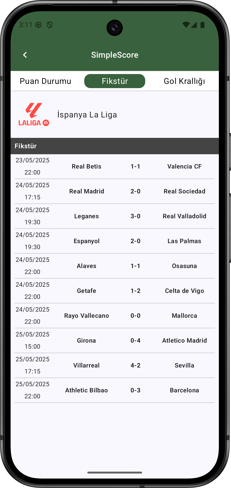

🔍 Overview
 * SimpleScore is a modern football standings app that allows users to browse different football leagues and view live standings, match results, and top scorer stats.

## Screenshots

  
  
  

  
  

🧱 Architecture

 * The project follows Clean Architecture and MVVM (Model–View–ViewModel) pattern.

 * Single Activity structure with multiple Composable screens

 * Clear separation of responsibilities across data, domain, presentation, and di layers

📦 Package Structure

 * data -> Contains API services, response models, and repository implementations.

 * domain -> Defines the business-level repository interface used by the application.

 * presentation -> UI layer that includes composable screens, ViewModels, UI models, and mappers. Each feature (e.g., goalKings, leagueTabs) is modularized.

 * di -> Hilt modules are declared here for dependency injection (e.g., Retrofit, Repository, OkHttpClient).

 * utils -> Constants, LeagueFilters, and helper class like LeagueImageProvider.

⚙️ Tech Stack

 * Kotlin, Coroutines, StateFlow
 * Jetpack Compose – Declarative UI toolkit
 * Hilt – Dependency injection
 * Retrofit – API client
 * Navigation Component – For screen navigation
 * Material3, Accompanist System UI Controller

